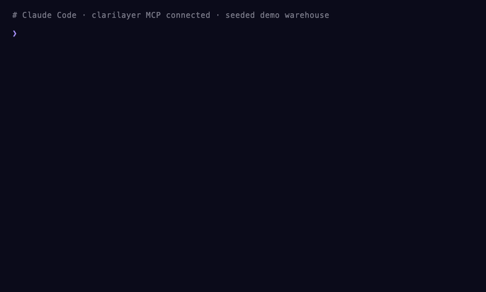

<p align="center">
  
</p>

<h1 align="center">ClariLayer</h1>

<p align="center">
  <b>Stop re-explaining your data to your AI every session.</b>
</p>

<p align="center">
  The individual-analyst <b>context layer</b>, delivered over <b>MCP</b>.<br/>
  Connect it to Claude Code, Cursor, or Codex — your agent stops making the same data mistakes.
</p>

<p align="center">
  <a href="https://clarilayer.com">Website</a> ·
  <a href="https://clarilayer.com/docs">Docs</a> ·
  <a href="https://clarilayer.com/auth/sign-up">Get started (free)</a> ·
  <a href="https://clarilayer.com/use-cases">Use cases</a>
</p>

<p align="center">
  
  
  
</p>

---

> ClariLayer is an individual-analyst context layer, delivered over MCP. Connect it to Claude Code, Cursor, or Codex and it bootstraps your real working context from the SQL and dbt you already have, reconciles your definitions against your warehouse, and remembers your corrections — so your agent stops re-explaining your data and stops making the same mistakes every session.

<p align="center">
  
</p>
<p align="center">
  <sub><i>A seeded demo warehouse: your agent <b>recalls</b> a saved definition, <b>reconciles</b> it against real results, and the mismatch is flagged as a <code>caveat</code> that's waiting next session. Statuses are <code>asserted</code> / <code>caveat</code> — never "verified".</i></sub>
</p>

## The problem

Every new session, your AI coding agent starts from zero about *your* data. So it makes the same mistakes — queries the wrong table, picks the wrong join, counts refunds in revenue, uses a churn definition you deprecated months ago. You correct it. Next session, it forgets, and you correct it again.

A hand-written `CLAUDE.md` of definitions helps a little — but it has the *same trust problem as the original numbers*: it's just asserted text. Nobody checked it against your warehouse.

## What ClariLayer does

It gives your agent a durable, **reconciled** memory of your data context — and it lives **inside the agent you already use**, over [MCP](https://modelcontextprotocol.io). Four verbs, all live:

| Verb | What it does |
|---|---|
| **recall** | Before writing SQL or defining a metric, your agent pulls the most relevant saved context — each with its provenance and status. Read-only, in-flow. |
| **remember** | Saves one durable fact — a definition, schema note, reusable query, assumption, caveat, or decision — so it survives across sessions. |
| **bootstrap** | Bulk-imports context from artifacts you already have: validated SQL (deterministically structured), dbt models, and `CLAUDE.md` / freeform notes. No cold empty store. |
| **reconcile** | Grounds a saved definition against your **real** warehouse result. Your agent runs the SQL with its own access and reports back, so a declared-vs-actual mismatch surfaces as a **caveat**. |

The context you build **compounds** across sessions and is **portable** across Claude Code, Cursor, and Codex.

## Install

**Fastest — one command.** Auto-detects Claude Code, Cursor, and Codex, writes the right config, and offers to add the standing-orders block to your `CLAUDE.md`:

```bash
npx clarilayer init
```

You'll need a free context key — sign up at **[clarilayer.com](https://clarilayer.com/auth/sign-up)**, then open **Connect your AI** to mint one. The CLI prompts for it and validates it. Full options: **[CLI.md](./CLI.md)**.

<details>
<summary><b>Prefer to wire it up by hand?</b></summary>

<br/>

Replace `cl_YOUR_CONTEXT_KEY` with your key.

**Claude Code** — run in your terminal:

```bash
claude mcp add --transport http clarilayer https://clarilayer.com/api/mcp/mcp --header "Authorization: Bearer cl_YOUR_CONTEXT_KEY"
```

**Cursor** — add to `~/.cursor/mcp.json`:

```json
{
  "mcpServers": {
    "clarilayer": {
      "url": "https://clarilayer.com/api/mcp/mcp",
      "headers": { "Authorization": "Bearer cl_YOUR_CONTEXT_KEY" }
    }
  }
}
```

**Codex** — add to `~/.codex/config.toml`. Recent Codex connects to the URL directly, **no Node/`npx` needed** (same as Claude Code and Cursor):

```toml
[mcp_servers.clarilayer]
url = "https://clarilayer.com/api/mcp/mcp"
http_headers = { "Authorization" = "Bearer cl_YOUR_CONTEXT_KEY" }
```

Only on older Codex without direct-HTTP support, bridge it via `mcp-remote` instead — this route **requires Node.js** (`npx`):

```toml
[mcp_servers.clarilayer]
command = "npx"
args = ["-y", "mcp-remote", "https://clarilayer.com/api/mcp/mcp", "--header", "Authorization: Bearer cl_YOUR_CONTEXT_KEY"]
```

</details>

See **[QUICKSTART.md](./QUICKSTART.md)** for the full walkthrough and troubleshooting.

## Then tell your agent to actually use it

Paste this into your project's `CLAUDE.md` (or `AGENTS.md`) so your agent reaches for ClariLayer proactively instead of waiting to be asked. The full file is in [`examples/CLAUDE.md`](./examples/CLAUDE.md):

```markdown
## ClariLayer — your data context layer (use it proactively)

ClariLayer is connected over MCP and holds this project's durable data context: definitions, schema notes, reusable SQL, assumptions, caveats, and decisions. Use it WITHOUT waiting to be asked.

- Recall first: before writing SQL, defining or computing a metric, or answering a question about this data, call `get_analysis_context` (pass a `use_case`). Build on what is already known instead of re-deriving it.
- Write back as you learn: when you establish a durable fact — a definition, schema note, reusable query (attach the SELECT as `sql`), assumption, caveat, or decision — save it with `remember`. Use `propose` for suggestions (they go to the human's review inbox).
- Reconcile on drift: if a definition's SQL changed or staleness is flagged, call `reconcile` to check it against the warehouse.
- Stay honest: treat status as `asserted`/`caveat`, never `verified`.
```

## What makes it different from a plain `CLAUDE.md`

`reconcile`. A saved definition isn't just trusted — your agent runs its SQL against your warehouse and reports the result shape back, and ClariLayer compares declared-vs-actual. A mismatch becomes a **caveat** so you and your agent know exactly what to trust.

> **On trust language — we keep it honest.** Today ClariLayer's two statuses are **`asserted`** and **`caveat`**. A stronger **`verified`** status is *not* shipped yet — it's the documented fast-follow. We reconcile and flag caveats; we don't claim your context is "verified." ([why](https://clarilayer.com/docs))

## Your data stays yours

**ClariLayer never holds your warehouse credentials and never executes SQL server-side.** Your agent is the connector — it runs queries with its own access and sends back result metadata plus any optional preview rows *it* chooses to include. ClariLayer stores the context, not your warehouse keys.

## Pricing

**Free for individuals** — install, recall, remember, bootstrap, and reconcile are unmetered for single-player use. Team-merge, governance, and the Contract API are the secondary *for teams* expansion strand. See **[clarilayer.com/pricing](https://clarilayer.com/pricing)**.

## Get started

1. **[Sign up free →](https://clarilayer.com/auth/sign-up)**
2. Open **Connect your AI** and mint a context key
3. Paste the install command for your agent (above)
4. In your next session, ask your agent to `bootstrap` from your `./sql` folder — then watch the first `reconcile`

## FAQ

**Is this open source?**
This repo — the docs, examples, and (soon) a thin setup CLI — is MIT licensed. The **ClariLayer service itself is hosted and proprietary**; you connect to it with a free account. This repo is the front door, not the product source.

**Where does my data go?**
Your context (definitions, notes, SQL you choose to save) is stored in your ClariLayer account. Your warehouse credentials are never sent to ClariLayer, and ClariLayer never runs SQL against your warehouse — your agent does that locally. See [Your data stays yours](#your-data-stays-yours).

**Which agents are supported?**
Claude Code, Cursor, and Codex today — anything that speaks MCP over Streamable HTTP.

**I have a team / need governance.**
That's the *for teams* strand — ownership, approvals, the one right metric, and the Contract API. Start [here](https://clarilayer.com/use-cases).

---

<p align="center">
  <sub>Built for analysts who live in their AI agent. · <a href="https://clarilayer.com">clarilayer.com</a></sub>
</p>
